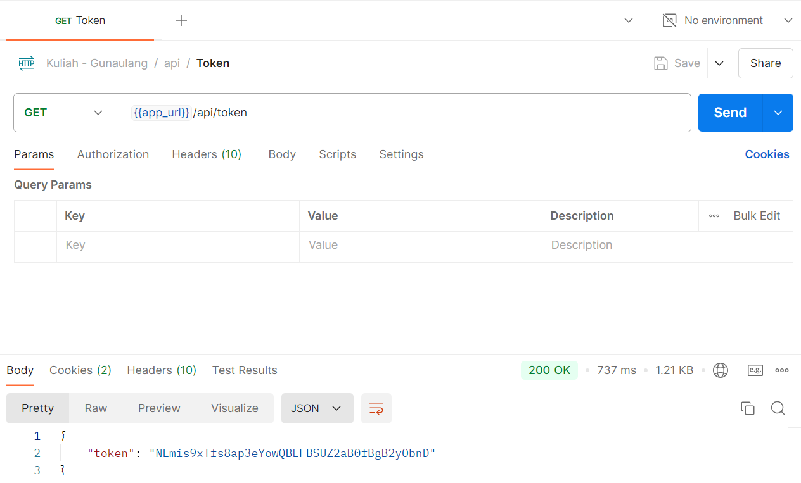

<p align="center"><a href="https://laravel.com" target="_blank"></a></p>

### Overview

This project is a backend API built with the Laravel framework. It helps manage donations, donation addresses, and blogs, while providing tools to analyze and compare donations over time.

Key features include:
- **Donation Management**: The API lets users create donations, including details like donor, recipient, products, and amounts.
- **Analytics**: It provides reports on donations by categories such as status, product, and time periods (weeks, months, etc.).
- **Address and Blog Management**: Users can save and update their addresses and blog posts.

### Prerequisites

Make sure you have the following installed on your system:

- [Git](https://git-scm.com/downloads)
- [Docker](https://docs.docker.com/engine/install/)
- [Docker Compose](https://docs.docker.com/compose/install/linux/)
- [PHP 8.2](https://www.php.net/manual/en/install.php)
- [PHP Composer](https://getcomposer.org/download/)
- Copy the `.env.example` file to `.env` and update the values ​​as necessary (e.g. credentials, logs, etc), leave the defaults to avoid failures when running [Quick Start](#quick-start).

### Quick Start

Run the following simple command:

```bash
git clone https://github.com/Team-1-Web-Programming/backend
cd backend
docker compose -f docker-compose.dev.yml up -d
composer install
php artisan key:generate
php artisan cache:clear
php artisan migrate
php artisan db:seed --class=AdminPermissionSeeder
php artisan serve --host=0.0.0.0 --port=8000
```

This command sets up the backend server. It clones the repository, starts the development environment, install PHP dependencies, generates the application key, clears the cache, runs the database migrations, seeds initial data (admin permissions), and finally starts the Laravel development server.

<p align="center">
  </img>
</p>

## License

The Laravel framework is open-sourced software licensed under the [MIT license](https://opensource.org/licenses/MIT).
